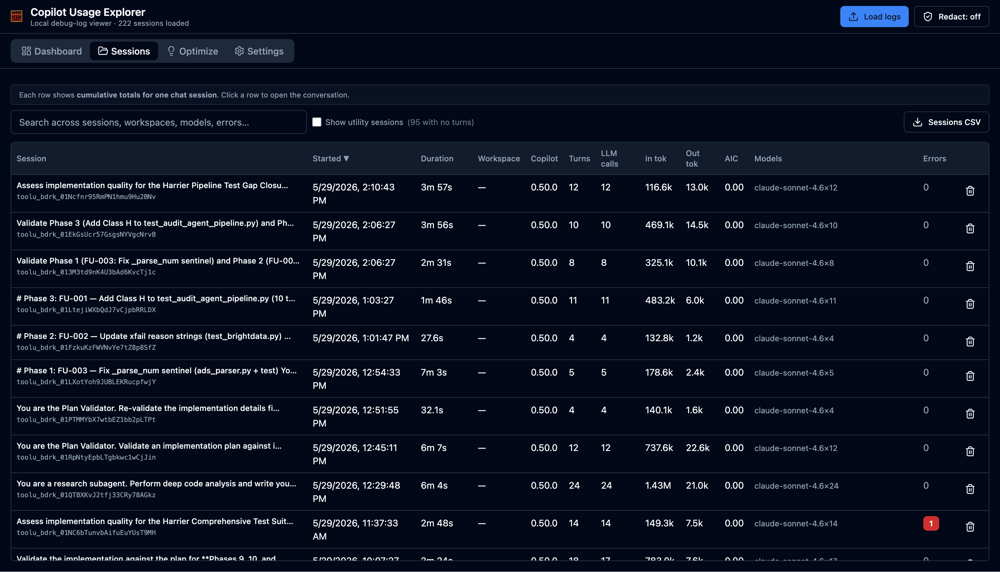
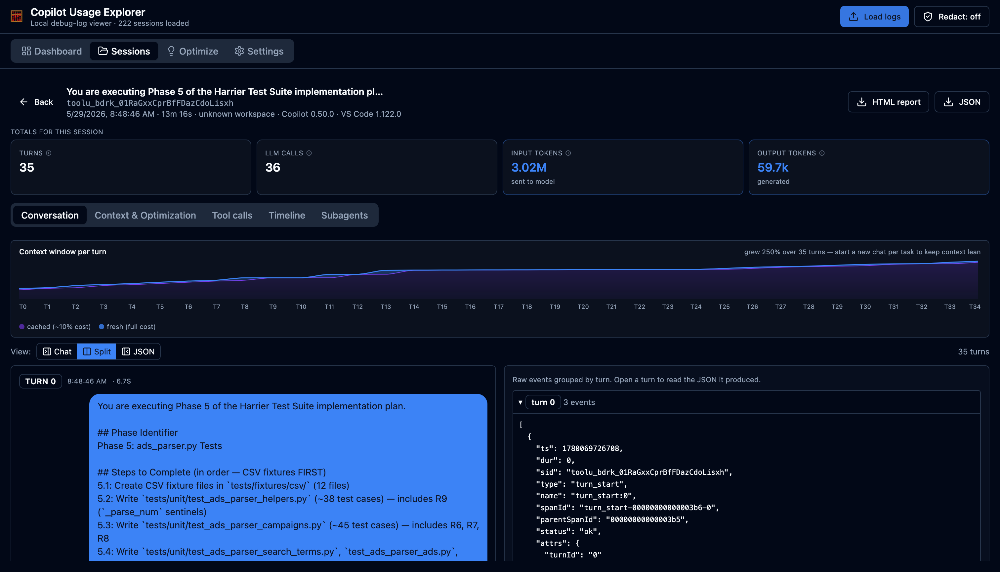
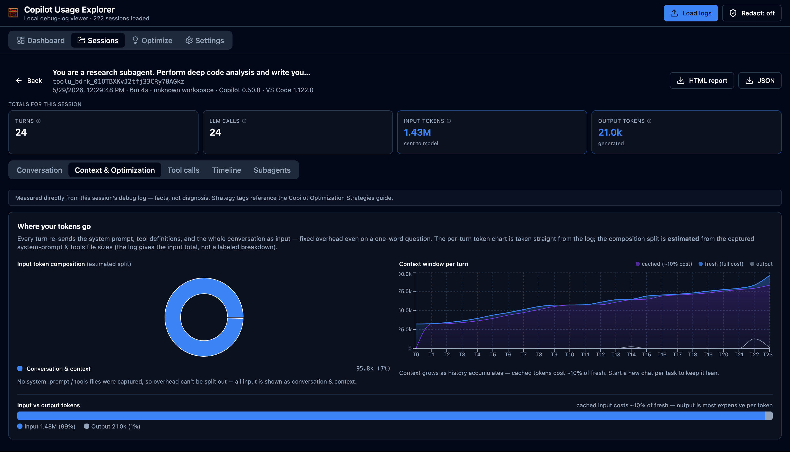

# Copilot Usage Explorer

> Local, browser-based viewer for **GitHub Copilot Chat agent debug logs** (`main.jsonl`). Built for individual developers who need answers like _"How many tokens did this session burn?"_ and _"Which tool or system-prompt overhead is bloating my requests?"_

🧮 **Tokens, not dollars.** Everything you see is read straight from the debug logs — input/output token counts, turns, LLM calls, tool calls, errors, and AI Credits (when the log reports them). There is no pricing, USD cost, or premium-request estimation anywhere in the app. Primary input/output/cached counts are the log's own reported values; the few derived views the log doesn't itself tokenize (system-prompt/tools sizing, the input-composition breakdown) fall back to a character-based estimate (~4 chars/token).

🔒 **100% local.** All parsing happens in your browser. No upload, no telemetry, no backend.

🌐 **Live demo:** **<https://kevrcress.github.io/CopilotUsageExplorer/>** — load your own `main.jsonl`; everything is parsed in-browser and nothing is uploaded.

---

## Screenshots

<!-- Capture instructions and filenames: screenshots/README.md -->

| Sessions list | Session detail | Token / insights charts |
|---|---|---|
|  |  |  |

---

## Quick start

```bash
npm install
npm run dev          # http://localhost:5173
npm run test         # Vitest parser / ingest / token-rollup tests
npm run build        # static bundle in dist/  (deploy to GitHub Pages)
```

### Enable Copilot debug logging

In VS Code (Copilot Chat 0.45+):

1. Settings → search for **`github.copilot.chat.agentDebugLog.fileLogging.enabled`** → enable.
2. Restart Copilot Chat (or VS Code).
3. New sessions write to:
   - **Windows:** `%APPDATA%\Code\User\workspaceStorage\<workspaceHash>\GitHub.copilot-chat\debug-logs\<sessionId>\`
   - **macOS:** `~/Library/Application Support/Code/User/workspaceStorage/<workspaceHash>/GitHub.copilot-chat/debug-logs/<sessionId>/`
   - **Linux:** `~/.config/Code/User/workspaceStorage/<workspaceHash>/GitHub.copilot-chat/debug-logs/<sessionId>/`

### Open logs

Click **Load logs** in the header to open the ingest dialog:
- **Upload files / folder** works in any browser, or
- Drag any of `debug-logs/`, a single session folder, or a single `main.jsonl` onto the drop area, or
- On Chromium-based browsers, use **Open folder…** (File System Access API) and **Start live-tail** to poll a folder every 5 s and stream new sessions/events into the UI. (Both are hidden on paths the browser blocks, such as Windows `%APPDATA%` — use Upload or a symlink under `%USERPROFILE%` there.)

Sessions are cached in IndexedDB so reopening the app is instant. Re-loading the same folder is safe — richer parses overwrite thinner ones, so nothing already-loaded gets wiped.

---

## What you get

The app has four top-level tabs: **Dashboard**, **Sessions**, **Optimize**, and **Settings**. On first run, Dashboard shows a welcome screen and a **Load your Copilot debug logs** button in place of the KPI strip.

### Dashboard
- **KPI strip** — total tokens (in/out split), cached input, LLM calls (+ tool calls), wasted tokens (errored calls), and an **AI Credits** card (only shown when the log reports `copilotUsageNanoAiu`).
- **Daily token usage** — input vs output tokens per day, filterable by date range.
- **Top optimization opportunities** — the top 3 pattern-derived findings for the selected period, with a link to the full Optimize tab.
- **Heaviest sessions** — top 5 sessions by total tokens, click to open.

### Sessions tab
Sortable / filterable table, one row per session: **session title** (AI-generated from `chatSessions/<id>.jsonl` when available, else the first user message, else the raw id) + session id, started, duration, workspace, Copilot version, turns, LLM calls, input tokens, output tokens, **AI Credits**, model breakdown, error count. Sessions with zero turns (chat-title generation, background utility runs) are hidden by default — a checkbox reveals them. A **Sessions CSV** export button writes one row per session.

### Session detail
Open a session to get five tabs:

- **Conversation** _(default)_ — a collapsible split: chat bubbles on the left (user / assistant / inline tool calls, including the usually-hidden `reasoning`), raw JSON turns on the right, grouped by turn with a divider between each. A **Chat / Split / JSON** toggle controls the layout. Above it, a stacked **context-window-per-turn** chart splits each turn's primary model call into **cached** (~10% cost) vs **fresh** (full cost) vs output tokens, so you can see both context growth and cache health at a glance. Turns with a notably low cache hit show a neutral facts panel (hit %, tokens reprocessed, model, idle gap, and what tool/subagent ran immediately before the call) — it states what happened, not why, since the log doesn't capture cache-eviction causes.
- **Context & Optimization** — everything about where your tokens go and how to reduce them, all measured directly from this session's log:
  - **Peak context / AI Credits / History re-sent** summary strip
  - **Top opportunities in this session** — up to 3 deterministic findings (unused tools, low-cache-hit turns, context growth, trivial calls on frontier models) ranked by cumulative tokens involved, each tagged with a strategy reference (e.g. "Strategy #10 · Disable unused tools")
  - **Where your tokens go** — an estimated input-token composition donut (system prompt / tools / conversation) plus the per-turn cached/fresh/output chart
  - **By model** — per-model table with tier badges, calls, input/output tokens
  - **Tool budget** — how many of the captured tool definitions were ever called, and the token weight of the ones that weren't (tool schemas travel on every request)
  - **Context sent to the model** — the active file over time and any #file/#prompt attachments Copilot actually sent, reconstructed from the captured requests
  - **Cache health** — every notably-low-cache-hit turn, click through to jump straight to it in the Conversation tab
  - **Chat length** and **Health** — turn count, context growth multiple, errored events, wasted tokens, subagent run count, log size
  - **System prompt & tools** — captured `system_prompt_N.json` / `tools_N.json` files deduped by exact content (Copilot writes a new numbered file every time it builds a request, even when nothing changed, so a session with 30+ files often has only a handful of distinct prompts), each viewable Formatted or Raw with a heuristic token count
  - **Customizations** _(collapsed by default)_ — discoveries at session start, plus per-turn _Resolve Customizations_ events showing which skills/instructions/agents were attached or skipped
- **Tool calls** — name, args, result, duration, error.
- **Timeline** — every event in the JSONL, grouped by turn, filterable by type/name.
- **Subagents** — child session refs (chat-title generation and `runSubagent` subagent runs) with rolled-up token totals; click through to open the child log.

### Optimize (global tab)
- **Optimization tips** — findings detected from your actual usage across the selected date range (context growth, model-tier fit, tool-call overhead, prompt caching, failed calls, input/output ratio) plus always-on general tips, with an **AI Credits** badge for the period.
- **Model usage** — per-model table with a tier badge (**Lightweight / Versatile / Frontier**), call count, and input/output tokens.
- **Tokens by model** and **tokens by workspace** charts.
- **Tool usage** — per-tool call and failure counts.

### Settings
- Privacy notice and a configurable size warning before opening very large logs.
- **Clear all cached sessions.**
- **Backup & restore** — export/import the full IndexedDB cache as JSON.
- **Workspace name mapping** — assign friendly names to opaque workspace hashes.

### Exports
- **Sessions CSV** — one row per session, including AI Credits (Sessions tab).
- **Per-session HTML report** — self-contained, share-friendly.
- **Per-session JSON** — fidelity export.
- **Backup JSON** — full cache export/restore (Settings tab).
- **Redaction toggle** in the header replaces prompt/response bodies with `[redacted]` and hashes paths for any export.

---

## AI Credits

When the debug log includes `copilotUsageNanoAiu` on an `llm_request` event, the app sums it (÷ 1e9) into an **AI Credits (AIC)** figure — a billing-unit count reported by Copilot itself, not a computed price. It shows up wherever tokens do (Sessions list, session detail, Dashboard, Optimize) and is omitted entirely when the log doesn't capture it, rather than showing a fabricated zero. This is the one number in the app that maps to Copilot's own usage accounting — it is deliberately not converted to a dollar amount.

---

## Model tiers

Models are bucketed into three tiers purely by matching their id, to give a rough sense of weight:

| Tier | Matches model ids containing | Intent |
|---|---|---|
| **Lightweight** | `mini`, `flash`, `haiku` | Cheap, fast lane |
| **Versatile** | `sonnet`, `codex`, `gpt-5`, `gemini`+`pro` | Everyday default |
| **Frontier** | `opus`, `gpt-5.5` | Heaviest; use sparingly |

This is a display heuristic only — the app does not attach any price or quota to a tier.

---

## Schema reference

Every line in `main.jsonl` is shaped:

```json
{
  "v": 1,
  "ts": 1777483061160,
  "dur": 0,
  "sid": "<session-uuid>",
  "type": "...",
  "name": "...",
  "spanId": "...",
  "parentSpanId": "...",
  "status": "ok" | "error",
  "attrs": { ... }
}
```

| `type`              | Notable `attrs`                                                                                        | Notes |
|---------------------|--------------------------------------------------------------------------------------------------------|-------|
| `session_start`     | `copilotVersion`, `vscodeVersion`                                                                      | One per session |
| `user_message`      | `content`                                                                                              | Raw user input |
| `turn_start` / `turn_end` | `turnId`                                                                                         | Brackets one model turn |
| `llm_request`       | `model`, `inputTokens`, `cachedTokens`, `outputTokens`, `ttft`, `maxTokens`, `userRequest`, `inputMessages`, `systemPromptFile`, `toolsFile`, `copilotUsageNanoAiu` | **Primary token signal.** `userRequest` carries the current turn's `<attachments>` / `<editorContext>` when Copilot attached files or reported the active file. |
| `agent_response`    | `response`, `reasoning`                                                                                | Final assistant output |
| `tool_call`         | `args`, `result`, `error?`                                                                             | Built-in or MCP tool |
| `discovery`         | `details`, `category`, `source`                                                                        | Skills/agents/instructions/hooks loaded at start |
| `generic`           | `details`, `category`                                                                                  | Includes "Resolve Customizations" |
| `child_session_ref` | `childSessionId`, `childLogFile`, `label`                                                              | Pointer to a sub-session (title generation or a `runSubagent` run) |

The parser also detects `"cache_control":{"type":"ephemeral"}` markers inside `userRequest` / `inputMessages` for prompt-caching insight, and salvages readable text from `agent_response` payloads that Copilot truncates mid-JSON for very large tool calls.

---

## Privacy & safety

- 100% client-side parsing; no network calls.
- The app **never writes back** into the source `debug-logs/` folder.
- IndexedDB cache lives only in your browser profile.
- Toggle **Redact** to scrub bodies and hash paths in any export.
- Configurable size warning before opening very large folders.

---

## Other ways to run it

This is a monorepo: `apps/web` (this browser SPA), `apps/vscode-ext`, and `apps/electron` all share the same `packages/core` (parsing/tokens/insights) and `packages/ui` (components/state).

- **[VS Code extension](apps/vscode-ext/README.md)** — auto-discovers debug logs straight from this machine's `workspaceStorage`, no upload step. Sideloaded `.vsix` from GitHub Releases.
- **[Desktop app (Electron)](apps/electron/README.md)** — auto-discovers logs across every local VS Code / Insiders / VSCodium / Cursor install, with live tail and auto-update on Windows.

---

## Stack

TypeScript · React · Vite · Tailwind CSS · shadcn-style UI primitives (Radix UI) · TanStack Table & Virtual · Recharts · Zustand · Dexie · Vitest.

Token counts for the system-prompt and composition views use a `~4 chars/token` heuristic (`packages/core/src/tokenizer.ts`) — model-accurate tokenizers could be lazy-loaded by extending that module.

---

## Out of scope (v1)

- GitHub Copilot Admin API integration
- Team rollups / multi-user
- Modifying or replaying sessions
- Any data leaving the local machine

See `copilot-debug-log-viewer.prompt.md` for the full v1 spec.
